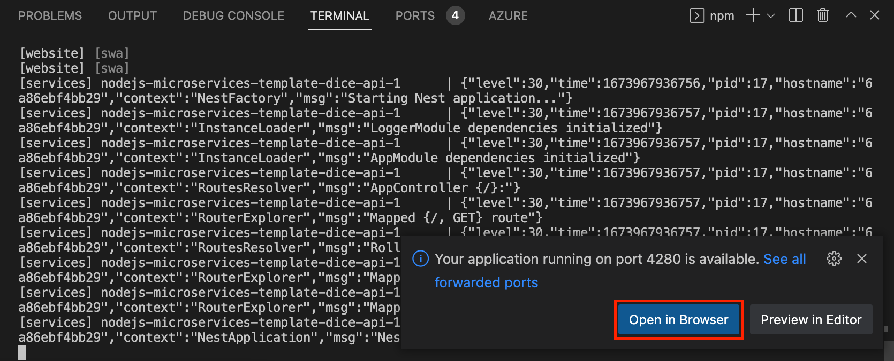
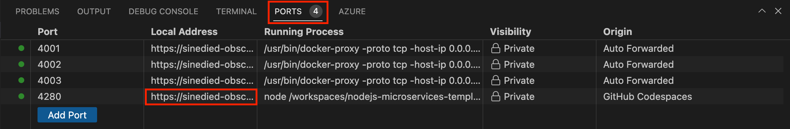
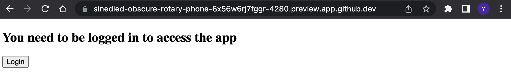
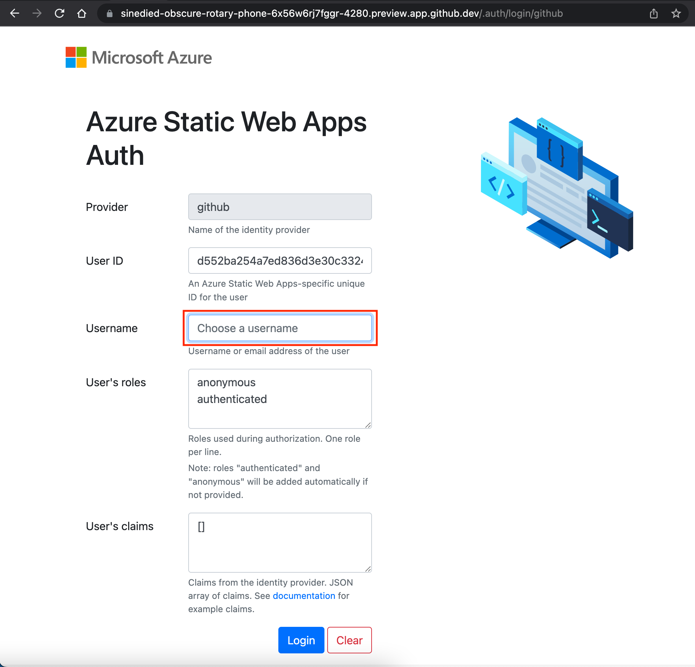
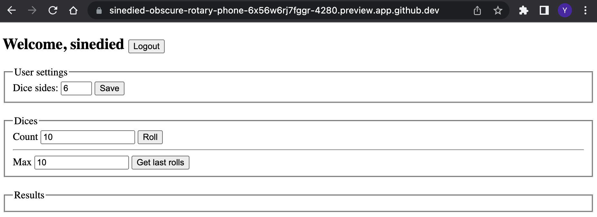
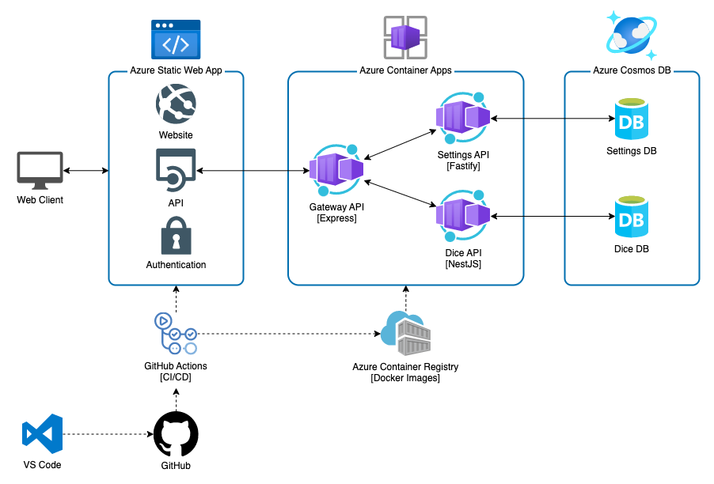
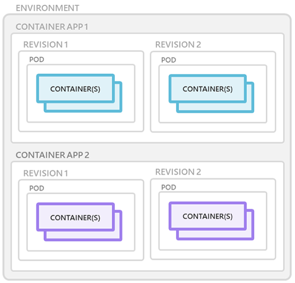
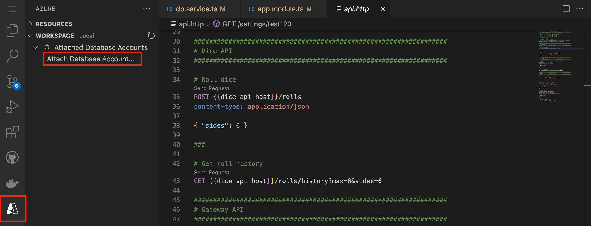
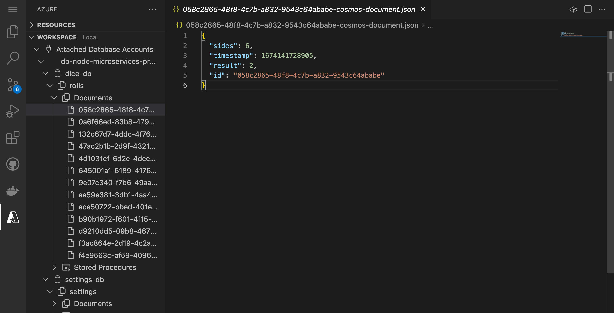

# Using GitHub Copilot to quickly build a Node.js application with Azure Cosmos DB and App Service

In this workshop, we'll explore how GitHub Copilot can be used to accelerate the development and deployment of a Node.js application. 

MyTodo is an [Express](https://expressjs.com/) app implementing a Todo list application. The application is mostly done, but needs a data service to talk to [Azure Cosmos DB](TODO) so we can store and retrieve the data. We also need to write some documentation, complete the tests and connect it to our API. Finally, we'll setup a CI/CD pipeline to deploy our app to [Azure App Service](TODO), using [GitHub Actions](TODO).

## You'll learn how to...
- Use [GitHub Copilot](TODO) to assist you in writing code, tests and documentation
- Create a data service to connect to Azure Cosmos DB
- Setup a CI/CD pipeline with GitHub Actions
- Deploy a Node.js app to Azure App Service

## Prerequisites

| | |
|----------------------|------------------------------------------------------|
| GitHub account       | [Get a free GitHub account](https://github.com/join) |
| Azure account        | [Get a free Azure account](https://azure.microsoft.com/free) |
| A web browser        | [Get Microsoft Edge](https://www.microsoft.com/edge) |
| JavaScript knowledge | [JavaScript tutorial on MDN documentation](https://developer.mozilla.org/docs/Web/JavaScript)<br>[JavaScript for Beginners on YouTube](https://www.youtube.com/playlist?list=PLlrxD0HtieHhW0NCG7M536uHGOtJ95Ut2) |

We'll use [GitHub Codespaces](https://github.com/features/codespaces) to have an instant dev environment already prepared for this workshop.

If you prefer to work locally, we'll also provide instructions to setup a local dev environment using either VS Code with a [dev container](https://aka.ms/vscode/ext/devcontainer) or a manual install of the needed tools.

---

## Preparation

Before starting the development, we'll need to setup our project and development environment. This includes:

- Setting up GitHub Copilot on your account
- Creating a new project on GitHub based on a template
- Using a prepared dev container environment on either [GitHub Codespaces](https://github.com/features/codespaces) or [VS Code with Dev Containers extension](https://aka.ms/vscode/ext/devcontainer) (or a manual install of the needed tools)

### Setting up GitHub Copilot

To use GitHub Copilot, you need to either enroll as an individual or use Copilot for Business:   [see GitHub Copilot plans](https://github.com/features/copilot#pricing). If you're not already enrolled, you can start a free trial at the URL above.

Once you're enrolled, you need to sign up for the [GitHub Copilot Labs](https://githubnext.com/projects/copilot-labs/) program. This will give you access to new experimental features we'll use in this workshop.

To sign up, go to [GitHub Copilot Labs](https://githubnext.com/projects/copilot-labs/) and select **Sign up for Copilot Labs**. Follow the instructions to activate it on your GitHub account and you're all set!

### Creating the project

Open [this GitHub repository](https://github.com/azure-samples/copilot-nodejs-todo-template), select the **Fork** button and click on **Create fork** to create a copy of the project in your own GitHub account.

 TODO

Once the fork is created, select the **Code** button, then the **Codespaces** tab and click on **Create Codespaces on main**.


This will start the creation of a dev container environment, which is a pre-configured container with all the needed tools installed. Once it's ready, you have everything you need to start coding. It even ran `npm install` for you!

<div class="info" data-title="note">

> Codespaces includes up to 60 hours of free usage per month for all GitHub users, see [the pricing details here](https://github.com/features/codespaces).

</div>

#### [optional] Working locally with the dev container

If you prefer to work locally, you can also run the dev container on your machine. If you're fine with using Codespaces, you can skip directly to the next section.

To work on the project locally using a dev container, first you'll need to install [Docker](https://www.docker.com/products/docker-desktop) and [VS Code](https://code.visualstudio.com/), then install the [Dev Containers](https://aka.ms/vscode/ext/devcontainer) extension.

<div class="tip" data-title="tip">

> You can learn more about Dev Containers in [this video series](https://learn.microsoft.com/shows/beginners-series-to-dev-containers/). You can also [check the website](https://containers.dev) and [the specification](https://github.com/devcontainers/spec).

</div>

After that you need to clone the project on your machine:

1. Select the **Code** button, then the **Local** tab and copy your repository url.

 TODO

2. Open a terminal and run:

```bash
git clone <your_repo_url>
```

3. Open the project in VS Code, open the **command palette** with `Ctrl+Shift+P` (`Command+Shift+P` on macOS) and enter **Reopen in Container**.


The first time it will take some time to download and setup the container image, meanwhile you can go ahead and read the next sections.

Once the container is ready, you will see "Dev Container: Node.js" in the bottom left corner of VSCode:


#### [optional] Working locally without the dev container

If you want to work locally without using a dev container, you need to clone the project and install the following tools:

| | |
|---------------|--------------------------------|
| Git           | [Get Git](https://git-scm.com) |
| Node.js v18+  | [Get Node.js](https://nodejs.org) |
| Azure CLI     | [Get Azure CLI](https://learn.microsoft.com/cli/azure/install-azure-cli#install) |
| GitHub CLI    | [Get GitHub CLI](https://cli.github.com/manual/installation) |
| pino-pretty log formatter | [Get pino-pretty](https://github.com/pinojs/pino-pretty#install) |
| Bash v3+      | [Get bash](https://www.gnu.org/software/bash/) (Windows users can use **Git bash** that comes with Git) |
| Perl v5+      | [Get Perl](https://www.perl.org/get.html) |
| jq            | [Get jq](https://stedolan.github.io/jq/download) |
| A code editor | [Get VS Code](https://aka.ms/get-vscode) |

You can test your setup by opening a terminal and typing:

```sh
git --version
node --version
az --version
gh --version
bash --version
perl --version
jq --version
```

---

## Overview of the project

The project template you forked is a monorepo, a single repository containing multiple projects. It's organized as follows (for the most important files):

```sh
.azure/           # Azure infrastructure templates and scripts
.devcontainer/    # Dev container configuration
.github/          # GitHub Actions CI/CD pipeline
packages/         # The different parts of our app
|- server/        # The Express server, hosting the API and the website
+- client/        # The website client
api.http          # HTTP requests to test our API
package.json      # NPM workspace configuration
```

As we'll be using Node.js to build our API and website, we had setup a [NPM workspace](https://docs.npmjs.com/cli/using-npm/workspaces) to manage the dependencies of all the projects in a single place. This means that when you run `npm install` in the root of the project, it will install all the dependencies of all the projects and make it easier to work in a monorepo.

For example, you can run `npm run <script_name> --workspaces` in the root of the project to run a script in all the projects, or `npm run <script_name> --workspace=packages/server` to run a script for a specific project. 

Otherwise, you can use your regular `npm` commands in any project folder and it will work as usual.

<!-- ### About the codebase

We generated the base code of our differents services with the respective CLI or generator of the frameworks we'll be using, with very few modifications made so we can start working quickly on the most important parts of the workshop.

The only changes we made to the generated code is to remove the files we don't need, configure the ports for each API, and setup [pino-http](https://github.com/pinojs/pino-http) as the logger to have a consistent logging format across all the services.

<div class="info" data-title="note">

> If you want to see how the services were generated and the details of the changes we made, you can look at [this script](https://github.com/Azure-Samples/nodejs-microservices/blob/main/scripts/create-projects.sh) we used to generate the projects.

</div> -->

---

## Adding CosmosDB to your project

Our Todo application is almost complete! We need to add a database to store the tasks, and we'll use [Azure Cosmos DB](https://azure.microsoft.com/services/cosmos-db/) to do that, with the assistance of GitHub Copilot.

### About Azure Cosmos DB

Azure Cosmos DB is a fully managed NoSQL database service that offers multiple APIs, including SQL, MongoDB, Cassandra, Gremlin, and Azure Table storage. It's a globally distributed database, which means that your data can be replicated across multiple regions, and you can choose the closest region to your users to reduce latency. For our needs, we'll be using the SQL API along with the Node.js SDK. 

Surely, that may sound a bit strange, using SQL to access a NoSQL database? But don't worry, it's not a mistake. Cosmos DB is a *multi-model database*, which means that it can support different ways of accessing the data. SQL is the most common way of querying data, so it feels familiar to most developers and makes it easy to get started. Still, you must not forget that it's not relational database, so you can't make very complex queries and joins have to be avoided because of their performance impact.

### Creating the database service

First, we need to install the `@azure/cosmos` package:

```bash
cd packages/server
npm install @azure/cosmos
```

Once it's installed the package, create a new file `packages/server/src/services/database.ts` and start typing the following content in it:

```ts
// Import the @azure/cosmos SDK
```


### Creating the database plugin

To store the settings of each user, we'll need at some point a database. For now, we'll start by using a mock with an in-memory database, and we'll add the proper connection later when our database will be deployed.

Let's start by creating a plugin for Fastify to make it easy to use in our API.

Create a new file `packages/settings-api/plugins/database.js` with the following content:

```js
import fp from 'fastify-plugin'

// the use of fastify-plugin is required to be able
// to export the decorators to the outer scope

export default fp(async function (fastify, opts) {
  fastify.decorate('db', new MockDatabase());
});
```

Plugins in Fastify are just functions that receive the Fastify instance and the options passed to the plugin. All plugins within the `plugins/` folder will be automatically loaded by Fastify when the server starts.

Using the `decorate` method, we can add properties to the Fastify instance, which will be available in all the routes of our API. It's a form of [dependency injection](https://en.wikipedia.org/wiki/Dependency_injection). We use it here to provide a `db` property that will be an instance of our database service.

Now we'll implement the `MockDatabase` class. Add this code at the bottom of the file:

```js
class MockDatabase {
  constructor() {
    this.db = {};
  }

  async saveSettings(userId, settings) {
    await this.#delay();
    this.db[userId] = settings;
  }
  
  async getSettings(userId) {
    await this.#delay();
    return this.db[userId];
  }

  async #delay() {
    return new Promise(resolve => setTimeout(resolve, 10));
  }
}
```

<div class="tip" data-title="tip">

> We are using the **async/await** keywords to allow asynchronous, promise-based behavior to be written like regular synchronous code. You can read more about it in the [MDN documentation](https://developer.mozilla.org/docs/Learn/JavaScript/Asynchronous/Promises#async_and_await).

</div>

As you can see, we are using a simple object to store the settings of each user. We are also adding a delay of 10ms to simulate the latency of a real database call.

<div class="tip" data-title="tip">

> Did you noticed the `#` before the `#delay()` method? This new feature of JavaScript means that this method is private, and only class members are allowed to call it. You can read more about it in the [MDN documentation](https://developer.mozilla.org/docs/Web/JavaScript/Reference/Classes/Private_class_fields).

</div>


### Testing our application

We're now ready to test our whole application locally. To do so, we need to start in parallel the SWA CLI and the Docker compose environment with our services.

To make this easier, we already set up a few script in the `package.json` located at the root of the project.

```json
  "scripts": {
    "start": "concurrently npm:start:* --kill-others",
    "start:services": "docker compose up",
    "start:website": "npm run start --workspace=website",
  },
```

Here's what each script does:
- `start` uses [concurrently](https://www.npmjs.com/package/concurrently) package to run multiple scripts in parallel, here we use it to start all the NPM scripts matching the `start:*` pattern
- `start:services` starts the Docker compose environment with our services
- `start:website` starts the SWA CLI with our website

In short, we can start our complete application locally by running `npm start` at the root of the project:

```bash
# Go back to the project's root
cd ../..
npm start
```

This may take a few seconds to start everything, but after a while VS Code should propose you to open the application running on port `4280` in your browser:



Select **Open in Browser** to open the website.

<div class="tip" data-title="tip">

> If you don't see the dialog, you can select the **Ports** tab in the bottom panel, and click on the "Local Address" link next to port `4280`:
>
> 

</div>

You should see the login page of our application:



If you select **Login**, you'll be redirected to the SWA CLI authentication emulator login page:



This is a fake login page made for local testing, where you can enter various parameters to simulate different users. Fill in any **Username** and select **Login**.

You should be redirected back to the application main UI:



You can now test the application as you would normally do, trying to update your settings, roll the dice, etc.

After you're done testing, you can stop the application by pressing `Ctrl+C` in the terminal.

---

## Azure setup

Azure is Microsoft's cloud platform. It provides a wide range of services to build, deploy, and manage applications. We'll use a few of them in this workshop to run our application.

First, you need to make sure you have an Azure account. If you don't have one, you can create a free account including Azure credits on the [Azure website](https://azure.microsoft.com/free/).

<!-- <div class="important" data-title="important">

> If you're following this workshop in-person at SnowCamp, you can use the following link to get a 50$ Azure Pass credit: [redeem your Azure Pass](https://azcheck.in/sno230125)

</div> -->

Once you have your Azure account, open a terminal at the root of the project and run:

```bash
.azure/setup.sh
```

This script uses the [Azure CLI](https://learn.microsoft.com/cli/azure) and [GitHub CLI](https://cli.github.com/) to do the following:
- Login into your Azure account
- Select a subscription to use
- Create a [service principal](https://learn.microsoft.com/azure/active-directory/develop/howto-create-service-principal-portal), a token that will be used to create or update resources in Azure
- Login into your GitHub account
- Add the `AZURE_CREDENTIALS` secret to your GitHub repository, with your the service principal token

Before reading further, let's run the script that will create all the Azure resources we'll need for this workshop, as it will take a few minutes to complete (we'll explain what it does a bit later):

```bash
.azure/infra.sh update
```

### Introducing Azure services

Let's look again at our application architecture diagram we saw earlier:



To run and monitor our application, we'll use various Azure services:

| Service | Description |
| ------- | ----------- |
| [Azure Container Apps](https://learn.microsoft.com/azure/container-apps/) | A managed service to run containers in Azure, with built-in load balancing, auto-scaling, and more. |
| [Azure Static Web Apps](https://learn.microsoft.com/azure/static-web-apps/) | A service to host websites, with built-in authentication, serverless API functions or proxy, Edge CDN and more. |
| [Azure Cosmos DB](https://learn.microsoft.com/azure/cosmos-db/) | A NoSQL globally distributed database, that supports SQL, MongoDB, Cassandra, Gremlin, and Azure Table storage APIs. |
| [Azure Container Registry](https://learn.microsoft.com/azure/container-registry/) | A container registry to store and manage container images. |
| [Azure Log Analytics](https://learn.microsoft.com/azure/log-analytics/) | A service to collect and analyze logs from your Azure resources. |
| [Azure Monitor](https://learn.microsoft.com/azure/azure-monitor/) | A service to monitor your Azure resources, with built-in dashboards, alerts, and more. |

Azure Log Analytics doesn't appear in our diagram, but we'll use it to collect logs from our containers and use them to debug our application when needed. Azure Monitor isn't explicitly part of our infrastructure, but it's enabled across all Azure resources, and we'll use it to monitor our application and build a dashboard.

#### About Azure Container Apps

The primary service we'll use is [Azure Container Apps](https://learn.microsoft.com/azure/container-apps/overview), a fully managed serverless container service on Azure. It allows you to run containerized applications without worrying about orchestration or managing complex infrastructure such as Kubernetes.

You write code using your preferred programming language or framework (in this workshop it's JavaScript and Node.js, but it can be anything), and build microservices with full support for [Distributed Application Runtime (Dapr)](https://dapr.io/). Then, your containers will scale dynamically based on HTTP traffic or events powered by [Kubernetes Event-Driven Autoscaling (KEDA)](https://keda.sh).

There are already a few compute resources on Azure: from IAAS to FAAS.
Azure Container Apps sits between PAAS and FAAS.
On one hand, it feels more PaaS, because you are not forced into a specific programming model and you can control the rules on which to scale out / scale in.
On the other hand, it has quite some serverless characteristics like scaling to zero, event-driven scaling, per second pricing and the ability to leverage Dapr's event-based bindings.


Container Apps is built on top of [Azure Kubernetes Service](https://learn.microsoft.com/azure/aks/), including a deep integration with KEDA (event-driven auto scaling for Kubernetes), Dapr (distributed application runtime) and Envoy (a service proxy designed for cloud-native applications).
The underlying complexity is completely abstracted for you.
So, no need to configure your Kubernetes service, ingress, deployment, volume manifests... You get a very simple API and user interface to configure the desired configuration for your containerized application.
This simplification means also less control, hence the difference with AKS.


Azure Container Apps has the following features:
- *Revisions*: automatic versioning that helps to manage the application lifecycle of your container apps
- *Traffic control*: split incoming HTTP traffic across multiple revisions for Blue/Green deployments and A/B testing
- *Ingress*: simple HTTPS ingress configuration, without the need to worry about DNS and certificates
- *Autoscaling*: leverage all KEDA-supported scale triggers to scale your app based on external metrics
- *Secrets*: deploy secrets that are securely shared between containers, scale rules and Dapr sidecars
- *Monitoring*: the standard output and error streams are automatically written to Log Analytics
- *Dapr*: through a simple flag, you can enable native Dapr integration for your Container Apps

Azure Container Apps introduces the following concepts:
- *Environment*: this is a secure boundary around a group of Container Apps.
They are deployed in the same virtual network, these apps can easily intercommunicate easily with each other and they write logs to the same Log Analytics workspace. An environment can be compared with a Kubernetes namespace.

- *Container App*: this is a group of containers (pod) that is deployed and scale together. They share the same disk space and network.

- *Revision*: this is an immutable snapshot of a Container App.
New revisions are automatically created and are valuable for HTTP traffic redirection strategies, such as A/B testing.



### Creating the infrastructure

Now that we know what we'll be using, let's create the infrastructure we'll need for this workshop.

You can use different ways to create Azure resources: the Azure CLI, the [Azure Portal](https://portal.azure.com), ARM templates, or even VS Code extensions or third party tools like Terraform.

All these tools have one thing in common: they all use the [Azure Resource Manager (ARM) API](https://docs.microsoft.com/azure/azure-resource-manager/management/overview) to create and manage Azure resources. The Azure CLI is just a wrapper around the ARM API, and the Azure Portal is a web interface to the same API.


Any resource you create in Azure is part of a **resource group**. A resource group is a logical container that holds related resources for an Azure solution, just like a folder.

When you ran the command `.azure/infra.sh update` earlier, it created a resource group name `rg-node-microservices-prod` with all the infrastructure for you, using Azure CLI and Infrastructure as Code (IaC) templates. We'll look at the details of the scripts later in this section.

### Introducing Infrastructure as Code

Infrastructure as Code (IaC) is a way to manage your infrastructure using the same tools and practices you use for your application code. In other words: you write code to describe the resources you need, and this code is committed to your project repository so you can use it to create, update, and delete your infrastructure as part of your CI/CD pipeline or locally.

It's a great way to ensure consistency and repeatability of your infrastructure, and allows to manage the infrastructure of your project just like you manage the code of your project.

There are many existing tools to manage your infrastructure as code, such as Terraform, Pulumi, or [Azure Resource Manager (ARM) templates](https://learn.microsoft.com/azure/azure-resource-manager/templates/overview). ARM templates are JSON files that allows you to define and configure Azure resources.

In this workshop, we'll use [Bicep](https://learn.microsoft.com/azure/azure-resource-manager/bicep/overview?tabs=bicep), a new language that abtracts ARM templates creation while being more concise, readable and easier to use.

#### What's Bicep?

Bicep is a Domain Specific Language (DSL) for deploying Azure resources declaratively. It aims to drastically simplify the authoring experience with a cleaner syntax, improved type safety, and better support for modularity and code re-use. It's a transparent abstraction over ARM templates, which means anything that can be done in an ARM Template can be done in Bicep.

Here's an example of a Bicep file that creates a Log Analytics workspace:

```bicep
resource logsWorkspace 'Microsoft.OperationalInsights/workspaces@2021-06-01' = {
  name: 'my-awesome-logs'
  location: 'westeurope'
  tags: {
    environment: 'production'
  }
  properties: {
    retentionInDays: 30
  }
}
```

A resource is made of differents parts. First, you have the `resource` keyword, followed by a symbolic name of the resource that you can use to reference that resource in other parts of the template. Next to it is a string with the resource type you want to create and API version.

<div class="info" data-title="note">

> The API version is important, as it defines the version of the template used for a resource type. Different API versions can have different properties or options, and may introduce breaking changes. By specifying the API version, you ensure that your template will work regardless of the product updates, making your infrastructure more resilient over time.

</div>

Inside the resource, you then specify the name of the resource, its location, and its properties. You can also add tags to your resources, which are key/value pairs that you can use to categorize and filter your resources.

Bicep templates can be split into multiple files, and you can use modules to reuse common parts of your infrastructure. You can also use parameters to make your templates more flexible and reusable.

Have a look at the files inside the folder `./azure/infra` to see how we created the infrastructure for this workshop. The entry point is the `main.bicep` file, which is the main template that use the differents modules located in the `./azure/infra/modules` folder.

Writing templates from scratch can be a bit tedious, but fortunately most of the time you don't have to:
- You can reuse templates for the [Azure Quickstart collection](https://github.com/Azure/azure-quickstart-templates/tree/master/quickstarts)
- The [Bicep VS Code extension](https://marketplace.visualstudio.com/items?itemName=ms-azuretools.vscode-bicep) help you write your templates, providing snippets, syntax highlighting, auto-completion, and validation.
- The [Bicep playground](https://aka.ms/bicepdemo) allows you to convert an ARM template to Bicep, and vice versa.

### Details about the `infra.sh` script

Because entering a bunch of commands one after the other in a terminal is not very fun, we made a Bash script to automate all the heavy lifting. This is the `.azure/infra.sh` script we ran earlier.

This script is a wrapper around Azure CLI commands. The `update` command does the following:

1. Run the command `az group create` to create a resource group if it doesn't exist yet.

2. Run the command `az deployment group create` to create or update the resources in the resource group. This command takes a Bicep template as input, and creates or updates the resources defined in the template.

3. Reformat the JSON deployment output from the previous command into the file `.<environment>.env`. You should see the file `.azure/.prod.env` that was created earlier.

4. Run `az` commands specific to the resources created, to retrieve secrets like the connection string for database or the registry credentials, and store them in the `.env` file.

If you're curious, you can have a look at the script to see how it works, and reuse it for your own projects.

---

<div class="info" data-title="skip notice">

> This step is entirely optional, you can skip it if you want to jump directly to the next section. In that case, your services won't persist the data and continue to use the in-memory storage, but you'll still be able to test and deploy the application.

</div>

## Connecting database


### Adding database to the Settings service

Then we'll make some changes to file `packages/settings-api/plugins/database.js` we created earlier. First, we need to add an import for the `@azure/cosmos` package:

```js
import { CosmosClient } from '@azure/cosmos';
```

Next, we'll add a new `Database` at the bottom of the file:

```js
class Database {
  constructor(connectionString) {
    this.client = new CosmosClient(connectionString)
  }

  async init() {
    const { database } = await this.client.databases.createIfNotExists({
      id: 'settings-db'
    });
    const { container } = await database.containers.createIfNotExists({
      id: 'settings'
    });
    this.settings = container;
  }

  async saveSettings(userId, settings) {
    await this.settings.items.upsert({ id: userId, settings });
  }
  
  async getSettings(userId) {
    const { resource } = await this.settings.item(userId).read();
    return resource?.settings;
  }
}
```

We're using the `@azure/cosmos` SDK to implement the same methods `saveSettings()` and `getSettings()` we used in our in-memory database.

In addition, we added a new method `init()` that we use to create the database and the container if they don't exist yet. Because the SDK functions called here are asynchronous, we could not use the class constructor for that.

Because Azure Cosmos DB is a NoSQL database, besides creating a database in our account, we also need to create a container to store the data. A container is a place to store a collection of documents, called **items** here.

Finally, we need to update how we register the database plugin. Replace the whole function `export default fp(async function (fastify, opts) { ... }` with:
  
```javascript
export default fp(async function (fastify, opts) {
  const connectionString = process.env.DATABASE_CONNECTION_STRING;
  if (connectionString) {
    const db = new Database(connectionString);
    await db.init();
    fastify.decorate('db', db);
    fastify.log.info('Connection to database successful.');
  } else {
    fastify.decorate('db', new MockDatabase());
    fastify.log.warn('No DB connection string provided, using mock database.');
  }
});
```

Here we're checking if the `DATABASE_CONNECTION_STRING` environment variable is set. In that case, we create a new `Database` instance and initialize it. Otherwise, we use the `MockDatabase` we created earlier.

#### Testing the database connection

We can now test the database connection. For that, we need to retrieve the connection string for the database.
As it's located in the `.azure/.prod.env` file created when we deployed the infrastructure, we can use this command to export it as an environment variable:

```bash
source ../../.azure/.prod.env
export DATABASE_CONNECTION_STRING
```

Then we can start the Settings service:

```bash
npm start | pino-pretty
```

If you see the message `Connection to database successful` in the console logs, the connection is working. You can test the API as usual, using the `api.http` file.

When you checked that everything is working, stop the server by pressing `Ctrl+C` in the terminal.

### Adding database to the Dice service

Now we'll do the same for the Dice service. Again, we need to install the `@azure/cosmos` package:

```bash
cd ../dice-api
npm install @azure/cosmos
```

Then we'll update the file `packages/dice-api/src/db.service.ts`. First, add this import of the `@azure/cosmos` package:

```ts
import { Container, CosmosClient } from '@azure/cosmos';
```

Then rename the existing `DbService` class to `MockDbService`.

After than, add this new `DbService` class at the bottom of the file:

```ts
@Injectable()
export class DbService {
  client: CosmosClient;
  rolls: Container;

  constructor(connectionString: string) {
    this.client = new CosmosClient(connectionString)
  }

  async init() {
    const { database } = await this.client.databases.createIfNotExists({
      id: 'dice-db',
    });
    const { container } = await database.containers.createIfNotExists({
      id: 'rolls',
    });
    this.rolls = container;
  }

  async addRoll(roll: Roll) {
    await this.rolls.items.create(roll);
  }

  async getLastRolls(max: number, sides: number) {
    const { resources } = await this.rolls.items
      .query({
        query: `SELECT TOP @max * from r WHERE r.sides = @sides ORDER BY r.timestamp DESC`,
        parameters: [
          { name: '@sides', value: sides },
          { name: '@max', value: max },
        ],
      })
      .fetchAll();
    return resources.sort((a, b) => a.timestamp - b.timestamp);
  }
}
```

We're doing here something very similar to what we did for the Settings service. We're using the `@azure/cosmos` SDK to implement the same methods `addRoll()` and `getLastRolls()` we used in our in-memory database, and added a new method `init()` to create the database and container if they don't exist yet.

If we take a look at the `getLastRolls()` method, we can see something interesting. We're using a SQL query to retrieve the last rolls. Notice that it's a [parameterized query](https://learn.microsoft.com/azure/cosmos-db/nosql/query/parameterized-queries), using the `max` and `sides` parameters of the function. While using a template string like:
```js
`SELECT TOP ${max} * from r WHERE r.sides = ${sides} ORDER BY r.timestamp DESC`
```
would be working, it's not safe against SQL injection attacks because it's comes from user input. Using parameterized queries is the recommended way to prevent these kind of attacks, as the parameters will be properly escaped by the SDK.

You can also notice that at the end of the function, we're sorting the results by timestamp. In the SQL query, we're using a reverse `ORDER BY` to get the last rolls, but we need to sort them again in the code to get them in the right order. This is one limitation of the SQL language support by Azure Cosmos DB, as it's not possible to use a subquery here to sort the results.

Finally, we need to update the file `app.module.ts`. In the `providers`, replace the existing `DbService` with this code:

```ts
{
  provide: DbService,
  useFactory: async () => {
    const logger = new Logger(DbService.name);
    const connectionString = process.env.DATABASE_CONNECTION_STRING;
    if (connectionString) {
      const db = new DbService(connectionString);
      await db.init();
      logger.log('Connection to database successful.');
      return db;
    }
    logger.warn('No DB connection string provided, using mock database.');
    return new MockDbService();
  },
}
```

Instead of using a standard provider, we're using a [factory](https://docs.nestjs.com/fundamentals/custom-providers#factory-providers-usefactory) to create our provider dynamically. A factory provider is a function that returns the actual provider.

In the same fashion as the Settings service, we're checking if the `DATABASE_CONNECTION_STRING` environment variable is set, and if it is, we're creating a `DbService` instance with the connection string, otherwise we create a `MockDbService` instance instead.

After that, we need to update two imports. Replace:

```ts
import { Module } from '@nestjs/common';
// ...
import { DbService } from './db.service';
```

with

```ts
import { Module, Logger } from '@nestjs/common';
// ...
import { DbService, MockDbService } from './db.service';
```

You may still a few errors in the code due to formatting, but it can be fixed automatically the command:

```bash
npm run format
```

#### Testing the database connection

We can now test the database connection. Just like with the Settings API, we can retrieve the connection string for the database with this command:

```bash
source ../../.azure/.prod.env
export DATABASE_CONNECTION_STRING
```

Then start the Dice service:

```bash
npm start | pino-pretty
```

If you see the message `Connection to database successful` in the console logs, the connection is working. Again, you can test the API using the `api.http` file.

When you checked that everything is working, stop the server by pressing `Ctrl+C` in the terminal.

### Looking at the data

By now you should have some data in your database. Sometimes, it can be interesting to look at the data directly in the database, for example to check if the data is correct, or to debug an issue.

We can do that directly using VS Code, thanks to the [Azure Databases extension](https://marketplace.visualstudio.com/items?itemName=ms-azuretools.vscode-cosmosdb).

First, let's get our connection string. In a terminal run this command and copy the output:

```bash
echo $DATABASE_CONNECTION_STRING
```

Then select the **Azure icon** in the left panel, then click **Attach Database Account** under the Workspace panel:



Select **SQL** for the **Database type**, then paste the connection string and press **Enter**.

You should now see your database account in the panel. You can unfold it to see the databases, containers and items. If you select a document, you can see its content of the document in the right panel, and even edit it.



---

<div class="info" data-title="skip notice">

> If you want to skip the Docker compose details and jump directly to the next section, run this command in the terminal to get the completed code directly: `curl -fsSL https://github.com/Azure-Samples/nodejs-microservices/releases/download/latest/deploy.tar.gz | tar -xvz`
Then commit and push the changes to trigger the deployment.

</div>

## Adding CI/CD

Our code and infrastructure are ready, so it's time to deploy our application. We'll use [GitHub Actions](https://github.com/features/actions) to create a CI/CD workflow.

### What's CI/CD?

CI/CD stands for *Continuous Integration and Continuous Deployment*.

Continuous Integration is a software development practice that requires developers to integrate their code into a shared repository several times a day. Each integration can then be verified by an automated build and automated tests. By doing so, you can detect errors quickly, and locate them more easily.

Continuous Deployment pushes this practice further, by preparing for a release to production after each successful build. By doing so, you can get working software into the hands of users faster.

### What's GitHub Actions?

GitHub Actions is a service that lets you automate your software development workflows. A workflow is a series of steps executed one after the other. You can use workflows to build, test and deploy your code, but you can also use them to automate other tasks, like sending a notification when an issue is created.

It's a great way to automate your CI/CD pipelines, and it's free for public repositories.

### Adding a deployment workflow

To set up GitHub Actions for deployment, we'll need to create a new workflow file in our repository.
This file will contain the instructions for our CI/CD pipeline.

Create a new file in your repository with the path `.github/workflows/deploy.yml` and the following content:

```yml
name: Azure deployment
on:
  push:
    branches:
      - main

concurrency:
  group: deployment

jobs:
  build_and_deploy:
    runs-on: ubuntu-latest
    steps:
      - name: Checkout the project
        uses: actions/checkout@v3

      - name: Login to Azure
        run: .azure/setup.sh --ci-login
        env:
          AZURE_CREDENTIALS: ${{ secrets.AZURE_CREDENTIALS }}

      - name: Update infrastructure
        run: .azure/infra.sh update

      - name: Build project
        run: .azure/build.sh

      - name: Deploy project
        run: .azure/deploy.sh
```

Let's take some time to decompose this workflow file.

First, the `on` section defines when the workflow should be triggered. In this case, we want to trigger the workflow when a push is made to the `main` branch. You can trigger workflows on any event happening in your repository, like when an issue is created, or when a pull request is merged.

Then, the `concurrency` section defines how to handle multiple runs of the workflow, for example if multiple commits are pushed and the previous workflow hasn't finished yet. In this case, we'll simply wait for the previous workflow to finish before starting a new one by specifying a unique name. By default, workflows will run in parallel.

In the `jobs` section, we can define one or more jobs to execute. In this case, we only have one job, called `build_and_deploy`. We can specify the platform and operating system to use with the `runs-on` property, in our case we'll use a linux machine with the latest version of Ubuntu. Different platforms are available such as Windows or macOS, and CPU architectures as well like ARM. The default [runner images](https://github.com/actions/runner-images#available-images) provided by GitHub Actions already have many tools pre-installed and will be enough for our needs, but if you need to use a specific setup you can either use a container image or add additional installation steps for the tools you want to use.

Finally, we can define the steps to execute in the job. Each step is a separate action, and we can use the `uses` property to specify a pre-defined action from the [GitHub Marketplace](https://github.com/marketplace?type=actions), or the `run` property to execute a command in the container. In our case, we first checkout the project, then login to Azure, update our infrastructure then build and deploy the project.

Notice that for the login step, we need to provide the `AZURE_CREDENTIALS` secret we created earlier. This secret is exposed to our script as an environment variable, using the `env` property.

But wait, we didn't write the `build.sh` and `deploy.sh` scripts yet!

### Writing the build script

To build our application, we need to do two things:
- Build the Docker image for our 3 microservices
- Build our website

Open the file `.azure/build.sh` and add the following content:

```bash
#!/usr/bin/env bash
set -euo pipefail
cd "$(dirname "${BASH_SOURCE[0]}")/.."

# Install dependencies
npm ci

# Build all Docker images
npm run docker:build --if-present --workspaces

# Build the website
npm run build --workspace=website
```

The first line is a [shebang](https://en.wikipedia.org/wiki/Shebang_(Unix)) that tells the shell which program to use to execute the script, here the `bash` program.

The next line `set -euo pipefail` sets [bash options](https://www.gnu.org/software/bash/manual/html_node/The-Set-Builtin.html) to exit if any command fails, or if an undefined variable is used. This is a good practice to avoid silent failures in your scripts.

The following line `cd "$(dirname "${BASH_SOURCE[0]}")/.."` changes the current directory to the root of the project. The command `dirname "${BASH_SOURCE[0]}"` gets the folder name of the current script. This is useful to ensure the current working directory is always the root of the project, even if the script is executed from a different folder.

After that, we install the dependencies and build our services and the website. Notice the `--workspaces` option that allows to run this script in every project of our workspace. We also used the `--if-present` option to skip the command if the script doesn't exist, like for the `website` project.

### Writing the deploy script

Next, we'll write the script to deploy our application. Open the file `.azure/deploy.sh` and add the following content:

```bash
#!/usr/bin/env bash
set -euo pipefail
cd "$(dirname "${BASH_SOURCE[0]}")"
source .prod.env
cd ..

# Get current commit SHA
commit_sha="$(git rev-parse HEAD)"

# Allow silent installation of Azure CLI extensions
az config set extension.use_dynamic_install=yes_without_prompt

echo "Logging into Docker..."
echo "$REGISTRY_PASSWORD" | docker login \
  --username "$REGISTRY_USERNAME" \
  --password-stdin \
  "$REGISTRY_NAME.azurecr.io"
```

The first part of the script is similar to the build script, we set the bash options and change the current directory, but in addition we source the variables and secrets from the `.prod.env` file so that we can use them in the script.

After that we prepare a few things:
- We get the current commit [SHA](https://en.wikipedia.org/wiki/Secure_Hash_Algorithms), so we can use it to tag our Docker images
- We configure the Azure CLI to allow the silent installation of Azure CLI extensions, like the `containerapp` extension we'll use later

Then we configure Docker to log into our private registry, so we can push our Docker images to it.

Now let's add below the commands to deploy our services:

```bash
echo "Deploying settings-api..."
docker image tag settings-api "$REGISTRY_NAME.azurecr.io/settings-api:$commit_sha"
docker image push "$REGISTRY_SERVER/settings-api:$commit_sha"

az containerapp update \
  --name "${CONTAINER_APP_NAMES[0]}" \
  --resource-group "$RESOURCE_GROUP_NAME" \
  --image "$REGISTRY_SERVER/settings-api:$commit_sha" \
  --set-env-vars \
    DATABASE_CONNECTION_STRING="$DATABASE_CONNECTION_STRING" \
  --query "properties.configuration.ingress.fqdn" \
  --output tsv

echo "Deploying dice-api..."
docker image tag dice-api "$REGISTRY_NAME.azurecr.io/dice-api:$commit_sha"
docker image push "$REGISTRY_SERVER/dice-api:$commit_sha"

az containerapp update \
  --name "${CONTAINER_APP_NAMES[1]}" \
  --resource-group "$RESOURCE_GROUP_NAME" \
  --image "$REGISTRY_SERVER/dice-api:$commit_sha" \
  --set-env-vars \
    DATABASE_CONNECTION_STRING="$DATABASE_CONNECTION_STRING" \
  --query "properties.configuration.ingress.fqdn" \
  --output tsv

echo "Deploying gateway-api..."
docker image tag gateway-api "$REGISTRY_NAME.azurecr.io/gateway-api:$commit_sha"
docker image push "$REGISTRY_SERVER/gateway-api:$commit_sha"

az containerapp update \
  --name "${CONTAINER_APP_NAMES[2]}" \
  --resource-group "$RESOURCE_GROUP_NAME" \
  --image "$REGISTRY_SERVER/gateway-api:$commit_sha" \
  --set-env-vars \
    SETTINGS_API_URL="https://${CONTAINER_APP_HOSTNAMES[0]}" \
    DICE_API_URL="https://${CONTAINER_APP_HOSTNAMES[1]}" \
  --query "properties.configuration.ingress.fqdn" \
  --output tsv
```

We'll do the same thing for our 3 services:
1. We tag the Docker image with the current commit SHA, and push it to our registry
2. We use the Azure CLI to update the container app with the new image, and set the environment variables for each service. For the settings and dice APIs, we set the database connection string, and for the gateway API we set the URLs of the other services.

<div class="tip" data-title="tip">

> The Azure CLI `--query` option allows to get a specific value from JSON response using [JMESPath syntax](https://jmespath.org/), while `--output tsv` sets the output format to a string. Here we use it to get the hostname of the container apps, as it might be helpful to debug the deployment if someone looks at the logs.

</div>

Let's continue with adding the command to deploy our website:

```bash
echo "Deploying website..."
cd packages/website
npx swa deploy \
  --app-name "${STATIC_WEB_APP_NAMES[0]}" \
  --deployment-token "${STATIC_WEB_APP_DEPLOYMENT_TOKENS[0]}" \
  --env "production" \
  --verbose
```

We use the Static Web Apps CLI this time deploy our website. Because it's installed locally in the `website` project, we need to invoke it with `npx`.

### Deploying the application

The workflow and scripts are complete, so it's time let the CI/CD pipeline do its job.

Commit all the changes you made to the repository, and push them, using either VS Code or the command line:

```bash
git add .
git commit -m "Setup CI/CD"
git push
```

The workflow will run automatically, so we can look at its progress directly on GitHub. Open your repository in a browser with this command:

```bash
gh repo view -w
```

Select the **Actions** tab, and you should see the workflow running. It will take a few minutes to complete, but you can follow the progress in the logs by clicking on the running workflow.


Then select the job name **build_and_deploy** on the left, and you should see the logs of the workflow.


When the workflow is complete, you should see a green checkmark.

### Testing the application

After your deployment is complete, you can finally test the application by opening the URL of the Static Web App in a browser. You can find the URL in the workflow logs, or using these commands:

```bash
source .azure/.prod.env 
open "https://$STATIC_WEB_APP_HOSTNAMES"
```

You should then see the website. Log in with your GitHub account, and you should be able to roll some dice!


---

## Conclusion

This is the end of the workshop. We hope you enjoyed it, learned something new and more importantly, that you'll be able to take this knowledge back to your projects.

If you missed any of the steps or would like to check your final code, you can run this command in the terminal to get the completed solution (be sure to commit your code first!): `curl -fsSL https://github.com/Azure-Samples/nodejs-microservices/releases/download/latest/solution.tar.gz | tar -xvz`

<div class="warning" data-title="had issues?">

> If you experienced any issues during the workshop, please let us know by [creating an issue](https://github.com/Azure-Samples/nodejs-microservices/issues) on the GitHub repository.

</div>

### Cleaning up Azure resources

<div class="important" data-title="important">

> Don't forget to delete the Azure resources once you are done running the workshop, to avoid incurring unnecessary costs!

</div>

To delete the Azure resources, you can run this command:

```bash
.azure/infra.sh delete
```

Or directly use the Azure CLI:

```bash
az group delete --name rg-node-microservices-prod
```

### References

- This workshop URL: [aka.ms/ws/node-microservices](https://aka.ms/ws/node-microservices)
- The source repository for this workshop: [GitHub link](https://github.com/Azure-Samples/nodejs-microservices)
- The base template for this workshop: [GitHub link](https://github.com/Azure-Samples/nodejs-microservices-template)
- If something does not work: [Report an issue](https://github.com/Azure-Samples/nodejs-microservices/issues)
