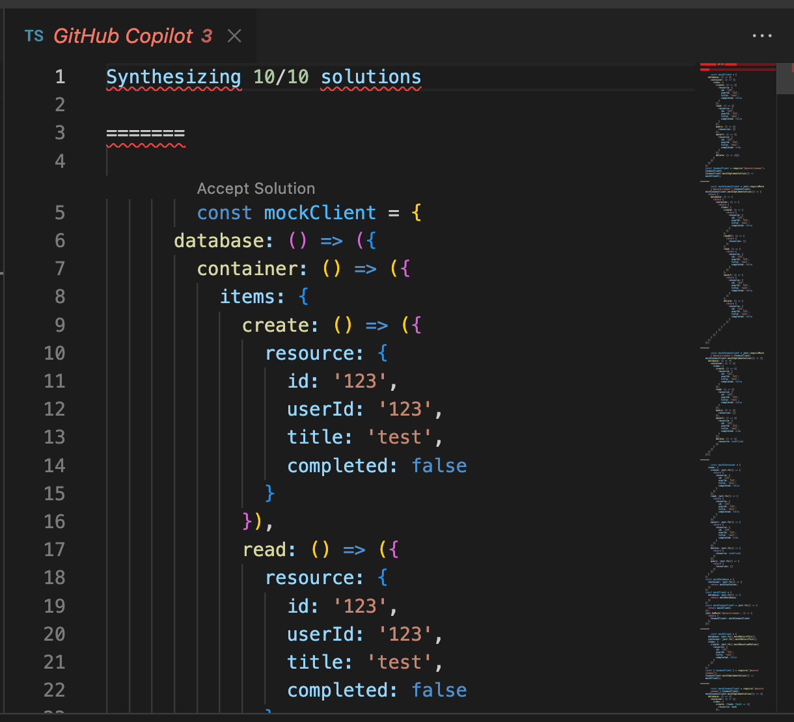

# Using GitHub Copilot to quickly build a Node.js application with Azure Cosmos DB and App Service

In this workshop, we'll explore how GitHub Copilot can be used to accelerate the development and deployment of a Node.js application with Azure Cosmos DB as a data store. 

MyTodo is an [Express](https://expressjs.com/) app implementing a Todo list application. The application is mostly done, but needs a data service to talk to [Azure Cosmos DB](https://azure.microsoft.com/services/cosmos-db/) so we can store and retrieve the data. We also need to write some documentation, complete the tests and connect it to our API. Finally, we'll setup a CI/CD pipeline to deploy our app to [Azure App Service](https://azure.microsoft.com/services/app-service/), using [GitHub Actions](https://github.com/features/actions).

## Objectives

You'll learn how to:
- Use [GitHub Copilot](https://github.com/features/copilot) to assist you in writing code, tests and documentation
- Create a data service to connect to Azure Cosmos DB
- Setup a CI/CD pipeline with GitHub Actions
- Deploy a Node.js app to Azure App Service

## Prerequisites

| | |
|----------------------|------------------------------------------------------|
| GitHub account       | [Get a free GitHub account](https://github.com/join) |
| Azure account        | [Get a free Azure account](https://azure.microsoft.com/free) |
| A web browser        | [Get Microsoft Edge](https://www.microsoft.com/edge) |
| JavaScript knowledge | [JavaScript tutorial on MDN documentation](https://developer.mozilla.org/docs/Web/JavaScript)<br>[JavaScript for Beginners on YouTube](https://www.youtube.com/playlist?list=PLlrxD0HtieHhW0NCG7M536uHGOtJ95Ut2) |

We'll use [GitHub Codespaces](https://github.com/features/codespaces) to have an instant dev environment already prepared for this workshop.

If you prefer to work locally, we'll also provide instructions to setup a local dev environment using either VS Code with a [dev container](https://aka.ms/vscode/ext/devcontainer) or a manual install of the needed tools.

---

## Preparation

Before starting the development, we'll need to setup our project and development environment. This includes:

- Setting up GitHub Copilot on your account
- Creating a new project on GitHub based on a template
- Using a prepared dev container environment on either [GitHub Codespaces](https://github.com/features/codespaces) or [VS Code with Dev Containers extension](https://aka.ms/vscode/ext/devcontainer) (or a manual install of the needed tools)

### Set up GitHub Copilot

To use GitHub Copilot, you need to either enroll as an individual or use Copilot for Business:   [see GitHub Copilot plans](https://github.com/features/copilot#pricing). If you're not already enrolled, you can start a free trial at the URL above.

Once you're enrolled, you need to install the [GitHub Copilot extension](https://marketplace.visualstudio.com/items?itemName=GitHub.copilot). When you install this extension, the [GitHub Copilot Chat extension](https://marketplace.visualstudio.com/items?itemName=GitHub.copilot-chat) is also installed.

### Create the project

Open [this GitHub repository](https://github.com/Azure-Samples/copilot-nodejs-todo-template), select the **Fork** button and click on **Create fork** to create a copy of the project in your own GitHub account.


Once the fork is created, select the **Code** button, then the **Codespaces** tab and click on **Create Codespaces on main**.


This will start the creation of a dev container environment, which is a pre-configured container with all the needed tools installed. Once it's ready, you have everything you need to start coding. It even ran `npm install` for you!

<div class="info" data-title="note">

> Codespaces includes up to 60 hours of free usage per month for all GitHub users, see [the pricing details here](https://github.com/features/codespaces).

</div>

#### [optional] Work locally with the dev container

If you prefer to work locally, you can also run the dev container on your machine. If you're fine with using Codespaces, you can skip directly to the next section.

To work on the project locally using a dev container, first you'll need to install [Docker](https://www.docker.com/products/docker-desktop) and [VS Code](https://code.visualstudio.com/), then install the [Dev Containers](https://aka.ms/vscode/ext/devcontainer) extension.

<div class="tip" data-title="tip">

> You can learn more about Dev Containers in [this video series](https://learn.microsoft.com/shows/beginners-series-to-dev-containers/). You can also [check the website](https://containers.dev) and [the specification](https://github.com/devcontainers/spec).

</div>

After that you need to clone the project on your machine:

1. Select the **Code** button, then the **Local** tab and copy your repository url.


2. Open a terminal and run:

```bash
git clone <your_repo_url>
```

3. Open the project in VS Code, open the **command palette** with `Ctrl+Shift+P` (`Command+Shift+P` on macOS) and enter **Reopen in Container**.


The first time it will take some time to download and setup the container image, meanwhile you can go ahead and read the next sections.

Once the container is ready, you will see "Dev Container: Node.js" in the bottom left corner of VSCode:


#### [optional] Work locally without the dev container

If you want to work locally without using a dev container, you need to clone the project and install the following tools:

| | |
|---------------|--------------------------------|
| Git           | [Get Git](https://git-scm.com) |
| Node.js v20+  | [Get Node.js](https://nodejs.org) |
| Azure CLI     | [Get Azure CLI](https://learn.microsoft.com/cli/azure/install-azure-cli#install) |
| GitHub CLI    | [Get GitHub CLI](https://cli.github.com/manual/installation) |
| Bash v3+      | [Get bash](https://www.gnu.org/software/bash/) (Windows users can use **Git bash** that comes with Git) |
| jq            | [Get jq](https://stedolan.github.io/jq/download) |
| A code editor | [Get VS Code](https://aka.ms/get-vscode) |

You can test your setup by opening a terminal and typing:

```sh
git --version
node --version
az --version
gh --version
bash --version
jq --version
```

---

## Overview of the project

The project template you forked is a monorepo, a single repository containing multiple projects. It's organized as follows (for the most important files):

```sh
.devcontainer/    # Dev container configuration
.github/          # GitHub Actions CI/CD pipeline
packages/         # The different parts of our app
|- server/        # The Express server, hosting the API and the website
+- client/        # The website client
api.http          # HTTP requests to test our API
package.json      # NPM workspace configuration
```

As we'll be using Node.js to build our API and website, we've setup a [NPM workspace](https://docs.npmjs.com/cli/using-npm/workspaces) to manage the dependencies of all the projects in a single place. This means that when you run `npm install` in the root of the project, it will install all the dependencies of all the projects and make it easier to work in a monorepo.

For example, you can run `npm run <script_name> --workspaces` in the root of the project to run a script in all the projects, or `npm run <script_name> --workspace=packages/server` to run a script for a specific project. 

Otherwise, you can use your regular `npm` commands in any project folder and it will work as usual.

---

## Add Cosmos DB

Our Todo application is *almost* complete. We need to add a database to store the tasks, and we'll use [Azure Cosmos DB](https://azure.microsoft.com/services/cosmos-db/) to do that, with the assistance of GitHub Copilot.

<div class="info" data-title="About Azure Cosmos DB">

>Azure Cosmos DB is Microsoft's fully managed and serverless distributed database with support for NoSQL and relational workloads. It offers global distribution across all Azure regions transparently replicating your data wherever your users are. Develop applications using open-source database engines, including PostgreSQL, MongoDB, and Cassandra. Get automatic scalability, enterprise-grade security, and cost-effective consumption-based pricing. For our needs, we'll be using the SQL API along with the Node.js SDK. 
>
>Surely, that may sound a bit strange, using SQL to access a NoSQL database? But don't worry, it's not a mistake. Cosmos DB is a *multi-model database*, which means that it can support different ways of accessing the data. SQL is the most common way of querying data, so it feels familiar to most developers and makes it easy to get started. Still, you must not forget that it's not relational database, so you can't make very complex queries and joins have to be avoided because of their performance impact.

</div>

### Create the database service

First, we need to install the `@azure/cosmos` package:

```bash
cd packages/server
npm install @azure/cosmos
```

Once it's installed the package, create a new folder `packages/server/src/services/`. Inside this folder create the file `db.ts` and start typing the following content in it:

```ts
// Import Azure Cosmos SDK and task model
```

As soon as you finish typing and hit enter, Copilot will suggest the first import for you:


<div class="tip" data-title="tip">

> If you have everything setup correctly, you should see the GitHub Copilot icon in the bottom right corner of your editor changing to a spinner as you type. If you don't see it, make sure you have the [GitHub Copilot extension](https://marketplace.visualstudio.com/items?itemName=GitHub.copilot) installed and enabled.

</div>

<details>
<summary>Example Copilot suggestions</summary>

```ts
import { CosmosClient } from '@azure/cosmos';
import { Task } from "../models/task";
```

</details>

Accept the suggestion by hitting the `Tab` key, hit `Enter` and accept the next suggestion again if needed to have both the imports we need.

Then continue by adding the following comment:

```ts
// Create a DbService class to wrap the Cosmos SDK with URI and key,
// connecting to the 'todos' database and 'tasks' container
// and with CRUD methods for tasks with proper naming
```

After hitting enter, and accept the suggestions as they come: Copilot should suggest a complete class definition for you!

<details>
<summary>Example Copilot suggestion</summary>

```ts
export class DbService {
  private client: CosmosClient;
  private container;

  constructor() {
    this.client = new CosmosClient({
      endpoint: process.env.COSMOS_ENDPOINT,
      key: process.env.COSMOS_KEY,
    });

    this.container = this.client
      .database('todos')
      .container('tasks');
  }

  async createTask(task: Task) {
    await this.container.items.create(task);
  }

  async readTasks() {
    const { resources } = await this.container.items.readAll().fetchAll();
    return resources;
  }

  async updateTask(task: Task) {
    await this.container.item(task.id).replace(task);
  }

  async deleteTask(task: Task) {
    await this.container.item(task.id).delete();
  }
}
```

</details>

<div class="info" data-title="note">

> Copilot generates new code for you dynamically, so the suggestion you get might be a bit different from the one shown here. But the idea is the same: it's a complete class definition with all the functions you need to implement the database service. If the suggestion is not to your liking, you can also cycle between differents suggestions using `Alt+]` (`Option+]` on macOS) and `Alt+]` (`Alt+[` on Windows)

</div>

Accept the suggestion, then if we look at the details, Copilot generated for you:
- A class definition with a constructor that connects to the Cosmos DB instance, and creates the database and container if they don't exist.
- All create, read, update, and delete (CRUD) operations for the tasks

How awesome is that?

### Fix the code

But wait, it seems that TypeScript is complaining about the `process.env.COSMOS_ENDPOINT` and `process.env.COSMOS_KEY` variables being possibly undefined. Let's fix that, again using Copilot. At the beginning of the class constructor, add this comment:

```ts
// Check that the environment variables are set
```

And then hit enter, multiple times until you get the wanted result. Copilot should progressively suggest the code to check the environment variables.

<details>
<summary>Example Copilot suggestion</summary>

```ts
if (!process.env.COSMOS_ENDPOINT) {
  throw new Error("COSMOS_ENDPOINT is not set");
}
if (!process.env.COSMOS_KEY) {
  throw new Error("COSMOS_KEY is not set");
}
```

</details>

Now look at the different methods Copilot generated for us. While it all looks correct, we would like to change the `getTasks()` method so that it only returns the tasks for a specified user ID.

To do that, delete the `readTasks()` function entirely and replace it with the comment `// Get all tasks for a user based on userId`. Then let Copilot generate it again for us. It will suggest new code line by line, accept the suggestions as they come until the function is complete.

<details>
<summary>Example Copilot suggestion</summary>

```ts
  async getTasks(userId: string): Promise<Task[]> {
    const querySpec = {
      query: 'SELECT * FROM c WHERE c.userId = @userId',
      parameters: [
        {
          name: '@userId',
          value: userId,
        },
      ],
    };

    const { resources } = await this.container.items.query(querySpec).fetchAll();
    return resources;
  };
}
```

</details>

The final result should look like this:

```ts
// Import Cosmos SDK and task model
import { CosmosClient } from "@azure/cosmos";
import { Task } from "../models/task";

// Create a DbService class to wrap the Cosmos SDK,
// connecting to the 'todos' database and 'tasks' container
// and with CRUD methods for tasks
export class DbService {
  private client: CosmosClient;
  private database: any;
  private container: any;

  constructor() {
    // Check that the environment variables are set
    if (!process.env.COSMOS_ENDPOINT) {
      throw new Error("COSMOS_ENDPOINT is not set");
    }
    if (!process.env.COSMOS_KEY) {
      throw new Error("COSMOS_KEY is not set");
    }

    // Connect to the database
    this.client = new CosmosClient({
      endpoint: process.env.COSMOS_ENDPOINT,
      key: process.env.COSMOS_KEY
    });
    this.database = this.client.database("todos");
    this.container = this.database.container("tasks");
  }

  // Create a new task
  async createTask(task: Task): Promise<Task> {
    // Create a new task in the database
    const { resource: createdItem } = await this.container.items.create(task);

    // Return the new task
    return createdItem;
  }

  // Get a task by id
  async getTask(id: string): Promise<Task> {
    // Get the task from the database
    const { resource: task } = await this.container.item(id).read();

    // Return the task
    return task;
  }

  // Get all tasks for a user
  async getTasks(userId: string): Promise<Task[]> {
    // Get the tasks from the database
    const { resources: tasks } = await this.container
      .items.query({
        query: "SELECT * FROM c WHERE c.userId = @userId",
        parameters: [{ name: "@userId", value: userId }]
      })
      .fetchAll();

    // Return the tasks
    return tasks;
  }

  // Update a task
  async updateTask(task: Task): Promise<Task> {
    // Update the task in the database
    const { resource: updatedItem } = await this.container
      .item(task.id)
      .replace(task);

    // Return the updated task
    return updatedItem;
  }

  // Delete a task
  async deleteTask(id: string): Promise<void> {
    // Delete the task from the database
    await this.container.item(id).delete();
  }
}
```

Of course, the code might not perfect (remember that the suggestions you get may be a bit different), but it's a good start given the little effort we had to put in. It's missing some type definitions, but keeping in mind that we only had to write a few comments to get a working database service, it's pretty amazing! And we didn't even had to go read the documentation of the Cosmos SDK.

### Add documentation

Speaking of documentation, it's always a good idea to add some comments to your code. Not only for other developers, but also for yourself when you come back to your code after a few weeks or months. Again, let's use Copilot to help us with the task.

Just before the `DbService` class definition, remove this comment that we added earlier:

```ts
// Create a DbService class to wrap the Cosmos SDK,
// connecting to the 'todos' database and 'tasks' container
// and with CRUD methods for tasks
```

And instead, start typing `/**` to add a JSDoc comment, and hit enter. Copilot will start suggesting the documentation for the class. You may start tying `This` and hit `Tab` then `Enter` to accept the suggestions as they come, until the documentation is complete. You should end up with something like this:

```ts
/**
 * This class provides a service for interacting with the Cosmos DB database.
 * It is a singleton class, so only one instance of it will ever exist.
 * @class
 * @property {CosmosClient} client - The Cosmos DB client
 * @property {any} database - The database
 * @property {any} container - The container
 * @method createTask - Create a new task
 * @method getTask - Get a task by id
 * @method getTasks - Get all tasks for a user
 * @method updateTask - Update a task
 * @method deleteTask - Delete a task
 */
```

Not bad, right? Wait, it's even mentioning something we forgot: the `DbService` class should be a singleton, as we don't want to create multiple connections to the database. Let's fix that.

This time, we'll try to use some black magic 👀.

Put your cursor at the end of this line in the `DbService` class:

```ts
private container: any;
```

Wow, now it even suggests you the comments! Accept that and continue, until you get what we need. You should end up with something like this:

```ts
// The singleton instance
private static instance: DbService;

// Get the singleton instance
public static getInstance(): DbService {
  if (!DbService.instance) {
    DbService.instance = new DbService();
  }
  return DbService.instance;
}
```

Don't you agree that this looks like black magic? We didn't even tell Copilot what we wanted, and it just gave us the code we needed. How useful is that?

### (Optional) Fix missing types with Copilot chat

Our database service is now almost perfect, but there's still one thing that bothers me: the types. We're using `any` for the `database` and `container` properties, which is not ideal. We could go back to the Cosmos SDK documentation and try to find the right types, but that would be a lot of work. Let's see if Copilot can help us with that.

In the VS Code toolbar, select the `Copilot Chat` from the menu:


Select the two problematic lines in your code:

```ts
private database: any;
private container: any;
```

Once they're highlighted, click on the **Add types** button in the **Brushes** panel:


Copilot will now try to find the right types for your variables. It will take a few seconds, but once it's done, you should see something like this:

```ts
private database: Database;
private container: Container;
```

<div class="info" data-title="note">

> Copilot Labs is still in beta, so it might not work perfectly every time. If it doesn't, you can always use `CTRL+Z` (`CMD+Z` on macOS) to undo the changes, and try again.

</div>

TypeScript is showing us an error now, because we're using the `Database` and `Container` types from the Cosmos SDK, but we didn't import them. Click on the blue lightbulb to open VS Code's quick fixes options, and select **Add all missing imports**:


Oh no, once we do that we get new errors! It seems that the return types of the `createTask()` and `updateTask()` methods are wrong. Replace `Promise<Task>` with `Promise<Task | undefined>` for both methods, and you should be good to go.

Thanks for the catch, TypeScript! 🙏

---

## Add unit tests

We now have a working database service, but we don't have any tests for it. We're good developers, so we should always write tests for our code. Let's see how Copilot can help us with that.

First, create a new file `packages/server/src/services/db.spec.ts` and add the following code:

```ts
import { DbService } from './db';

jest.mock('@azure/cosmos');

describe('DbService', () => {
  beforeAll(() => {
    // Set environment variables
    process.env.COSMOS_ENDPOINT = 'dummy';
    process.env.COSMOS_KEY = '123';

  });

  it('should get all tasks for a user', async () => {
    const dbService = new DbService();
    const tasks = await dbService.getTasks('123');
    expect(tasks).toEqual([]);
  });

});
```

<div class="tip" data-title="tip">

> We're using [Jest](https://jestjs.io/) as our test framework. If you're not familiar with it, don't worry, we won't go into too much details here. You can read more about it in the [Jest documentation](https://jestjs.io/docs/getting-started).

</div>

We've prepared a few things here. We're mocking the Cosmos SDK as we don't want to use the real thing, and we're setting the environment variables needed by the `DbService` class. Then we wrote a first test for the `getTasks()` method.

### Completing the test suite

First, let's add a few more tests. Put your cursor at the end of the `describe()` function, and hit `Enter` to create a new test.


<div class="tip" data-title="tip">

> If you're getting results too different from what's shown here, you can try adding the comment `// Test create new task` and start a new test with `it()`. Sometimes, when Copilot doesn't do what you want, giving some hints helps getting the results you're looking for.

</div>

If you continue acceptiong Copilot's suggestions, you should end up with a complete test suite for all the methods of the `DbService` class. Note that sometimes Copilot needs a little help, to get started writing the test or to close the final parentheses for each test. We may sometimes think that it has a mind of its own, just making sure you're paying attention 😉.

<details>
<summary>Example Copilot suggestions</summary>

```ts
it('should create a new task', async () => {
  const dbService = new DbService();
  const task = await dbService.createTask({
    id: '123',
    userId: '123',
    title: 'test',
    completed: false
  });
  expect(task).toEqual({
    id: '123',
    userId: '123',
    title: 'test',
    completed: false
  });
});

it('should get a task by id', async () => {
  const dbService = new DbService();
  const task = await dbService.getTask('123');
  expect(task).toEqual({
    id: '123',
    userId: '123',
    title: 'test',
    completed: false
  });
});

it('should update a task', async () => {
  const dbService = new DbService();
  const task = await dbService.updateTask({
    id: '123',
    userId: '123',
    title: 'test',
    completed: true
  });
  expect(task).toEqual({
    id: '123',
    userId: '123',
    title: 'test',
    completed: true
  });
});

it('should delete a task', async () => {
  const dbService = new DbService();
  const task = await dbService.deleteTask('123');
  expect(task).toEqual({
    id: '123',
    userId: '123',
    title: 'test',
    completed: true
  });
});
```

</details>

Since we've mocked out the Cosmos SDK completely with `jest.mock()`, all the tests should fail.
Run the following command in a terminal to launch the tests:

```bash
npm test
```

As expected, it fails. But that's a good thing, as good test writing is all about failing tests first!

### Mocking Cosmos SDK methods

To make it work, we need to now properly implement mocks for the Cosmos SDK methods.
Put your cursor at the end of the `beforeAll()` function, and hit `Enter`.


Wow, Copilot seems to know what we want to do! Let's accept this comment.
This time, instead of accepting the first suggestion, let's open the **Copilot toolbar** to see all the suggestions and pick the one that looks best to us.



A new panel should open on the right side of the screen, where you can scroll through all the suggestions Copilot has for you. Once you've found the one you like, click on **Accept solution** to insert the code and close the panel.

Save the file, and run the tests again. Oh no, 4 of the 5 tests are still failing! Let's see what's going on.

Scroll up to see the first test failure, and you should see that `fetchAll()` is not a function, meaning that it's not mocked properly. Let's fix that.


In the mocked `query()` method, remove this line `resources: []` of its current implementation, and wait for Copilot to suggest something.


<details>
<summary>Example Copilot suggestion</summary>

```ts
fetchAll: () => ({
  resources: []
})
```

</details>

Yes, that's it, Copilot caught up and is fixing its own mistake!
Let's accept the suggestions until it's complete, and run the tests again. This time, the last 3 tests are failing. Let's see what's going on with the first one.


Okay, slight mistake as it seems `container.item` is not mocked properly, and looked at the mocks Copilot generated everything was added to the `items` property, not `item`. Let's fix that.

Below the `items` property closing curly brace, add this code (Copilot might even suggest it for you):

```ts
item: () => ({

}),
```

Then move the `read()`, `upsert()` and `delete()` methods from the `items` block to the `item` block we juste added.

You should end up with something like this:

```ts
const mockClient = {
  database: () => ({
    container: () => ({
      items: {
        create: () => ({
          resource: {
            id: '123',
            userId: '123',
            title: 'test',
            completed: false
          }
        }),
        query: () => ({
          fetchAll: () => ({
            resources: []
          })
        }),
      },
      item: () => ({
        read: () => ({
          resource: {
            id: '123',
            userId: '123',
            title: 'test',
            completed: false
          }
        }),
        upsert: () => ({
          resource: {
            id: '123',
            userId: '123',
            title: 'test',
            completed: true
          }
        }),
        delete: () => ({})
      }),
    })
  })
};
```

Run the tests again, and... one last failure!


That's right, Copilot mocked an `upsert()` method, but not a `replace()` method. Just rename `upsert` to `replace` and this time, all tests should pass!

We've seen in this example that Copilot can help us write tests and mocks, but cannot do it all by itself. It needs some context to be able to suggest the right code, and sometimes we need to help it out a bit.
In the end, we still have our test suite written with very little effort and time!

---

## Update API routes

The database service is complete and fully tested, we can now update our API routes to use it.

Open the file `packages/server/src/routes/index.ts` and take a quick look at it. We've already created all the routes we need, but the implementation is all stubbed and with `TODO` comments all over the place as we didn't have the database service ready yet.

Time to remove all the *TODOs*!

### Import database service

First, we need to import our database service. At the top of the file, add the following line after the other imports:

```ts
import { DbService } from '../services/db';
```

### Remove stubs

#### Get tasks

Then, move on to our first TODO: `// TODO: get tasks from database`
On the line below, replace the right hand side of the assignment with `await DbService.getInstance`. As you type, Copilot should complete the code for you.


Accept the suggestion, and you're done for the first TODO, you can now remove the comment.

#### Create task

Move on to the next TODO, `// TODO: create task in database`.
On the line below, just type `await` and Copilot should do its magic again:


Accept the suggestion. But wait, something's missing here, we're not checking that the provided task is valid! Let's make sure the task has a `title` set before we're adding it into the database.

Just before the TODO comment, add the comment `// Check that the task has a title`, hit enter and see what Copilot came up with. Accept the suggestions until it's complete.

<details>
<summary>Example Copilot suggestion</summary>

```ts
// Check that the task has a title
if (!task.title) {
  return res.status(400).json({ error: 'Task title is required' });
}
```

</details>

That's it copilot, just what we needed! We can remove this TODO comment and move on to the next one.

#### Get a single task

The next TODO is `// TODO: get task from database`.
You know what to do now, replace the right hand part of the assignment below with `await` and let Copilot complete that for you.


Remove the TODO comment, next!

#### Update task

The next TODO is `// TODO: get existing task in database`.
Same as before, replace the right hand part of the assignment below with `await` and let Copilot complete that for you.


One down, do the same thing again for the next TODO, `// TODO: update task in database`.


Remove both TODO comments, and we're done with this one.

#### Delete task

Last one, we'll do the same procedure again for the TODO `// TODO: delete task in database`. On the line below the comment, just type `await` and let Copilot complete it for you.


Remove the final TODO comment, and our API is now complete.
That wasn't much work, right?

<!-- ### Test the API

It's now time to test our API! First we need to start the server. Run the following command in the terminal:

```bash
npm run dev:server
``` -->

---

## Deploy to Azure

Our todo application is now complete, let's deploy it on Azure!

Azure is Microsoft's cloud platform. It provides a wide range of services to build, deploy, and manage applications. We'll use [Azure App Service](https://azure.microsoft.com/products/app-service) here to deploy our app.

### Create an Azure account

First, you need to make sure you have an Azure account. If you don't have one, you can create a free account including Azure credits on the [Azure website](https://azure.microsoft.com/free/).

<!-- <div class="important" data-title="important">

> If you're following this workshop in-person at [CONFERENCE_NAME], you can use the following link to get a 50$ Azure Pass credit: [redeem your Azure Pass](https://azcheck.in/[EVENT_ID])

</div> -->

### Setup Azure credentials

Once you have your Azure account, open a terminal at the root of the project and run:

```bash
./setup.sh
```

This script uses the [Azure CLI](https://learn.microsoft.com/cli/azure) and [GitHub CLI](https://cli.github.com/) to do the following:
- Login into your Azure account
- Select a subscription to use
- Create a [service principal](https://learn.microsoft.com/azure/active-directory/develop/howto-create-service-principal-portal), a token that will be used to create or update resources in Azure
- Login into your GitHub account
- Add the `AZURE_CREDENTIALS` secret to your GitHub repository, with your the service principal token

You're all set to deploy your application from GitHub.

### Add CI/CD workflow

Our code and repository are ready, so it's time to write the deployment workflow. We'll use [GitHub Actions](https://github.com/features/actions) to create a CI/CD workflow.

<div class="info" data-title="note">

> CI/CD stands for *Continuous Integration and Continuous Deployment*.
> Continuous Integration is a software development practice that requires developers to integrate their code into a shared repository several times a day. Each integration can then be verified by an automated build and automated tests. By doing so, you can detect errors quickly, and locate them more easily.
> Continuous Deployment pushes this practice further, by preparing for a release to production after each successful build. By doing so, you can get working software into the hands of users faster.

</div>

#### What's GitHub Actions?

GitHub Actions is a service that lets you automate your software development workflows. A workflow is a series of steps executed one after the other. You can use workflows to build, test and deploy your code, but you can also use them to automate other tasks, like sending a notification when an issue is created.

It's a great way to automate your CI/CD pipelines, and it's free for public repositories.

#### Create workflow

To set up GitHub Actions for deployment, we'll need to create a new workflow file in our repository.
This file will contain the instructions for our CI/CD pipeline.

Create a new file in your repository with the path `.github/workflows/deploy.yml` and add the following content:

```yml
# This workflow for our node.js 20 app does the following:
# - run tests
# - build the app
# - login to Azure with AZURE_CREDENTIALS github secret
# - run Azure CLI command to deploy
```

After you hit `enter`, Copilot might be tempted to complete the comments, but that's not what we want to ignore it if that's the case by hitting `enter` again. It should not starts to complete the workflow, continue accepting suggestion until you end up with something like this:

```yaml
# This workflow for our node.js 20 app does the following:
# - run tests
# - build the app
# - login to Azure with AZURE_CREDENTIALS github secret
# - run Azure CLI command to deploy

name: Deploy to Azure

on:
  push:
    branches:
      - main

jobs:
  build:
    runs-on: ubuntu-latest
    steps:
      - uses: actions/checkout@v4
      - name: Use Node.js 20
        uses: actions/setup-node@v4
        with:
          node-version: 20
      - name: Install dependencies
        run: npm ci
      - name: Run tests
        run: npm test
      - name: Build
        run: npm run build
      - name: Login to Azure
        uses: azure/login@v2
        with:
          creds: ${{ secrets.AZURE_CREDENTIALS }}
      - name: Deploy to Azure
        run: |
          az webapp up -n ${{ secrets.AZURE_WEBAPP_NAME }} -g ${{ secrets.AZURE_RESOURCE_GROUP }} --sku F1
```

Not bad! Copilot did a great job here, but we still need to change a few things to make it work.

#### Update deployment commands

The last command is not enough to deploy our app, since we also need to create a Cosmos DB database and set the connection string.

Remove the command entirely, and let's go step by step to ask Copilot what we need. Add this first comment:

```bash
# Create resource group rg-copilot-nodejs-todo
```

Hit `enter`, and Copilot should suggest this command for you:

```bash
az group create --name rg-copilot-nodejs-todo --location eastus
```

Accept it, then now add this comment to create the database:

```bash
# Create cosmosdb with default api
```

Copilot should come up with something like this:

```bash
az cosmosdb create --name copilot-nodejs-todo --resource-group rg-copilot-nodejs-todo
```

Great! Accept it, and continue with this comment:

```bash
# Create database todos with collection tasks
```

Copilot should suggest something like these two lines:

```bash
az cosmosdb sql database create --name copilot-nodejs-todo --resource-group rg-copilot-nodejs-todo --db-name todos
az cosmosdb sql container create --name copilot-nodejs-todo --resource-group rg-copilot-nodejs-todo --db-name todos --collection-name tasks --partition-key-path /_partitionKey --throughput 400
```

Unfortunately, while looking like something that could work, it's not as the option names are incorrect. Maybe it's a sign that the `az cosmosdb` command-line could be improved to be more intuitive, but anyway, let's fix it. Change these two lines to:

```bash
az cosmosdb sql database create --account-name copilot-nodejs-todo --resource-group rg-copilot-nodejs-todo --name todos
az cosmosdb sql container create --account-name copilot-nodejs-todo --resource-group rg-copilot-nodejs-todo --database-name todos --name tasks --partition-key-path /id --throughput 400
```

As you can see, it's very subtle and the `--name` option have different meanings here, that's probably what caugh Copilot off guard. It's a great reminder that you should always check what it suggests you, as sometimes it can be off a bit. That's why you're pair programming with it, right?

Let's continue by adding this comment:

```bash
# Deploy webapp using node 20
```

Now it you suggest a command similar than what it did in the first place:

```bash
az webapp up --sku F1 --name copilot-nodejs-todo --resource-group rg-copilot-nodejs-todo --runtime "node|20-lts"
```

Again, accept it, but we'll need to tweak the `--name` option a bit to make it unique, as it will also serve as the URL for your web app. Change it to something like `--name nodejs-todo-YOUR_GITHUB_USERNAME`.

And now we need to retrieve the Cosmos DB endpoint and key. Add this comment:

```bash
# Retrieve cosmos endpoint
```

Copilot should suggest something like this:

```bash
cosmos_endpoint=$(az cosmosdb show --name copilot-nodejs-todo --resource-group rg-copilot-nodejs-todo --query documentEndpoint --output tsv)
```

Accept it. Now we need the key! Hit `enter` to go to the next line, and Copilot might event suggest the next comment for you (if not, add it):

```bash
# Retrieve cosmos key
```

Again, accept the suggestion that should be like this:

```bash
cosmos_key=$(az cosmosdb keys list --name copilot-nodejs-todo --resource-group rg-copilot-nodejs-todo --query primaryMasterKey --output tsv)
```

Almost there! Finally, we need set the environment variables in the web app. Add this comment:

```bash
# Set cosmos variables in web app
```

And Copilot should suggest a command like this:

```bash
az webapp config appsettings set --name nodejs-todo-sinedied --resource-group rg-copilot-nodejs-todo --settings COSMOS_ENDPOINT=$cosmos_endpoint COSMOS_KEY=$cosmos_key --output none
```

Check that the settings name are `COSMOS_ENDPOINT` and `COSMOS_KEY`, as it's important that they match the ones used in the code.

<div class="important" data-title="Important">

> Make sure this command ends with `--output none` to avoid leaking the Cosmos DB key in the logs! Add it if it's not there.

</div>

All good! Now we should be set and ready to deploy.

### Deploying the application

The workflow is now complete, so it's time to test it and see if it's working as intended.

Commit all the changes you made to the repository, and push them, using either VS Code or the command line:

```bash
git add .
git commit -m "Setup CI/CD"
git push
```

The workflow will run automatically, so we can look at its progress directly on GitHub. Open your repository in a browser with this command:

```bash
gh repo view -w
```

Select the **Actions** tab, and you should see the workflow running. It will take a few minutes to complete so you can grab a cup of coffee ☕. You can follow the progress in the logs by clicking on the running workflow.


Then select the job name **build** (or whatever name Copilot came up with) on the left, and you should see the logs of the workflow.


When the workflow is complete, you should see a green checkmark.


### Testing the application

After your deployment is complete, you can finally test the application by opening the URL of the Web App in a browser. You can find the URL in the workflow logs, or using these commands:

```bash
az webapp show \
  --name "nodejs-todo-YOUR_GITHUB_USERNAME" \
  --resource-group "rg-copilot-nodejs-todo" \
  --query "defaultHostName" \
  --output tsv
```

Open the URL returned by the command, and you should then see the website.


---

## Conclusion

That's it, the end of the workshop. As advertised, we *did* pair program with Copilot, but let's be honest, sometimes we felt more as the assitant as Copilot did most of the hard work for us. Like in any pair programming session, we still had to check what Copilot was doing, and guide it to the right direction. But overall, in a matter of minutes we were able to complete and deploy our application with minimal effort.

We hope you enjoyed following along, learned something new and more importantly, that you'll be able to take this experience back to your projects.

If you missed any of the steps or would like to check your final code, you can run this command in the terminal to get the completed solution (be sure to commit your code first!): `curl -fsSL https://github.com/Azure-Samples/copilot-nodejs-todo/releases/download/latest/solution.tar.gz | tar -xvz`

<div class="warning" data-title="had issues?">

> If you experienced any issues during the workshop, please let us know by [creating an issue](https://github.com/Azure-Samples/copilot-nodejs-todo/issues) on the GitHub repository.

</div>

### Cleaning up Azure resources

<div class="important" data-title="important">

> Don't forget to delete the Azure resources once you are done running the workshop, to avoid incurring unnecessary costs!

</div>

To delete the Azure resources, you can run this command:

```bash
az group delete --name rg-copilot-nodejs-todo --yes --no-wait
```

### References

- This workshop URL: [aka.ms/ws/copilot-todo](https://aka.ms/ws/copilot-todo)
- The source repository for this workshop: [GitHub link](https://github.com/Azure-Samples/copilot-nodejs-todo)
- The base template for this workshop: [GitHub link](https://github.com/Azure-Samples/copilot-nodejs-todo-template)
- If something does not work: [Report an issue](https://github.com/Azure-Samples/copilot-nodejs-todo/issues)
